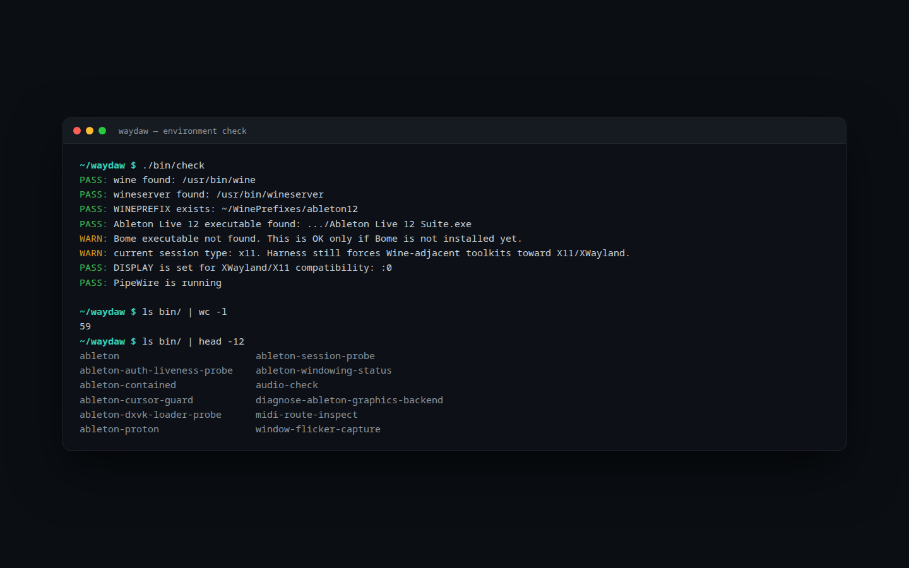

# waydaw

Minimal Linux Wayland Wine DAW harness for Ableton Live 12, Max for Live, Bome MIDI Translator Pro, and Windows VST2/VST3 plugins.

[Portfolio case study](https://timcis.com/projects/waydaw)



## What this demonstrates

- Explicit launchers and recovery operations for a shared Wine prefix.
- 59 focused, non-mutating diagnostic commands covering audio, MIDI, Wine,
  windowing, plugins, and application state.
- Evidence-led compatibility investigation documented alongside the scripts.
- Guardrails around known updater, authorization, routing, and presentation
  failures instead of opaque one-off shell fixes.

Start with the environment report:

```sh
./bin/check
```

The command reports prerequisites and known risks without installing packages
or mutating the shared prefix. Use `./bin/session` only after the checks match
the supported environment described below.

This is an operational wrapper around one shared Wine prefix:

```sh
~/WinePrefixes/ableton12
```

It is intentionally Bash-first, small, explicit, and easy to reset. It does not install Wine, Ableton, Bome, plugins, drivers, or system packages.

## Why One Prefix Matters

Ableton Live, Max for Live, Bome, plugin scanners, VST2/VST3 paths, registry state, licenses, and shared runtime DLLs need to see the same Windows environment. A single `WINEPREFIX` keeps that state in one place and avoids mismatches between DAW, MIDI tooling, and plugins.

The harness always uses:

```sh
WINEPREFIX="$HOME/WinePrefixes/ableton12"
```

## Why XWayland

The target desktop is KDE Plasma Wayland, but this MVP preserves XWayland compatibility by forcing common GUI toolkits toward X11:

```sh
GDK_BACKEND=x11
QT_QPA_PLATFORM=xcb
SDL_VIDEODRIVER=x11
```

That keeps Wine-adjacent windows, plugin editors, MIDI utilities, and older GUI assumptions on the most tested path for now.

## Why Gamescope Is Not In The Stable Harness

Gamescope is intentionally excluded from the stable launcher because this harness is not a compositor integration layer. The stable baseline remains one prefix, direct Wine launchers, explicit logs, and simple recovery commands.

Current windowing investigation may use Gamescope only as a manually launched one-off containment test. Do not add Gamescope integration until it is proven better than Wine virtual desktop and does not harm audio/MIDI.

Later experiments may include:

- gamescope one-off containment
- cage or labwc nested compositor containment
- native Wine Wayland driver only after containment options are exhausted

## Why Auto-Updates Are Disabled Under Wine

Ableton Live's in-app updater and swapper can leave unstable launch state under Wine. This harness treats update disabling as part of the supported operational model so the DAW starts from the installed application path instead of an updater handoff path.

The maintenance command never deletes updater state. It renames known updater paths to timestamped `.disabled.TIMESTAMP` backups:

```sh
./waydaw/bin/disable-ableton-updates
```

## Sharing Violation Behavior

The known failure mode is:

```text
Swapper: rename_1 stage failed: Sharing violation.
```

When that happens, Live may repeatedly enter updater loops, corrupt launch state, or exit unexpectedly. The launchers warn if these updater paths reappear:

```text
_autoupdates
_autoupdates/deltas
```

Ableton may recreate `_autoupdates` during normal startup. That path alone is treated as a warning. `_autoupdates/deltas` is a stronger warning because an update payload may be present. The swap marker remains a hard blocker:

```text
.Live 12 Suite_updated
```

If `.Live 12 Suite_updated` exists, `./waydaw/bin/session` exits before launching Bome or Ableton. Run:

```sh
./waydaw/bin/disable-ableton-updates
```

## Why Manual Updates Are Preferred

Manual updates are preferred because they keep installation and DAW launch as separate operations. Use the Ableton account installer manually, avoid the in-app updater, then disable updater state again before normal sessions.

Manual update workflow:

```sh
# 1. Backup ~/WinePrefixes/ableton12
# 2. Install the new Live build manually from your Ableton account
# 3. Avoid the in-app updater
./waydaw/bin/disable-ableton-updates
./waydaw/bin/check
pw-jack ./waydaw/bin/session
```

## Stable Operational Workflow

Recommended normal workflow:

```sh
./waydaw/bin/check
./waydaw/bin/disable-ableton-updates
./waydaw/bin/midi-check
./waydaw/bin/audio-check
pw-jack ./waydaw/bin/session
```

## Windowing Root Cause

The managed-window flicker under KDE Plasma Wayland is an XWayland frame-synchronization defect in KWin 5.27, fixed upstream in Plasma 6.2/6.3. Ubuntu 24.04 has no Plasma 6 backport. The two real fix paths are a release upgrade to Plasma 6.3+ or bypassing XWayland with Wine's native Wayland driver:

```sh
./bin/ableton-wayland
```

Evidence chain and ranked plan: `docs/ROOT_CAUSE_AND_FIX_PLAN.md`.

## Windowing Diagnostics

Windowing investigation is limited to KDE Plasma Wayland/XWayland behavior. It must not change the stable WineASIO, VirMIDI, ALSA, Bome, or session launch workflow.

Capture the current desktop, KWin, Wine process, Wine graphics registry, and DXVK/VKD3D prefix state:

```sh
./waydaw/bin/windowing-check
```

Native managed Ableton window experiments are paused under KDE Wayland. Do not use live `xprop`, `./waydaw/bin/window-identify`, or KDE Detect Window Properties against Ableton; even identification testing can recreate the uncloseable window state.

Manual comparison results belong in:

```sh
./waydaw/docs/WINDOWING_TEST_RESULTS.md
```

The safer containment investigation order is documented in:

```sh
./waydaw/docs/NATIVE_WINDOWING_NEXT_PLAN.md
```

KDE Window Rules are offline-only unless they can be prepared without launching the unsafe Ableton window:

```sh
./waydaw/docs/KDE_WINDOW_RULES_GUIDE.md
```

## Ableton Windowing Diagnosis Without Screenshots

Use these diagnostics when Ableton launches but the KDE titlebar, menu bar, window bounds, or flicker behavior needs to be diagnosed from logs only.

Start from a clean Ableton/Wine session:

```bash
./bin/kill-session
./bin/ableton
```

In another terminal, collect the log-only windowing data:

```bash
./bin/log-ableton-window-geometry
./bin/watch-ableton-window-geometry
./bin/diagnose-ableton-windowing
```

These commands do not take screenshots and do not use Wine virtual desktop. Do not make new windowing fixes until the diagnostic output identifies the failing layer with:

```text
derived_issue=...
rule_fired=...
evidence=...
```

## Linux MIDI Routing Model

Under Linux, MIDI routing is owned by the host audio/MIDI system, not by Windows kernel drivers inside Wine. The practical model for this harness is:

- ALSA sequencer MIDI exposes hardware and virtual MIDI clients.
- JACK MIDI exposes graph-routed MIDI ports.
- PipeWire can host and bridge audio/MIDI graphs, including JACK-compatible clients when PipeWire JACK support is present.
- Wine applications see only the devices and drivers that Wine, WineASIO, ALSA, JACK, and PipeWire expose to them.

Use the diagnostics before a real session:

```sh
./waydaw/bin/midi-check
./waydaw/bin/audio-check
```

## Why Bome Virtual MIDI Drivers Are Not Used Under Wine

Bome's BMIDI virtual MIDI ports are Windows kernel drivers. Those drivers do not function as native Linux kernel MIDI drivers when Bome runs under Wine. The supported operational path is to run Bome for translation logic and use native Linux MIDI routing for virtual ports and device connections.

Use ALSA/JACK/PipeWire MIDI ports instead of relying on BMIDI under Wine.

## MIDI/Bome Verification

Bome MIDI Translator Pro can run in the shared Wine session, but BMIDI virtual ports should not be assumed under Wine. BMIDI is a Windows driver path, not the Linux-native foundation for routing.

Verify Bome and Ableton participation through the host graph instead:

```sh
pw-jack ./waydaw/bin/session
./waydaw/bin/bome-midi-check
./waydaw/bin/session-status
```

`bome-midi-check` inspects ALSA MIDI with `aconnect -l`, PipeWire links with `pw-link -l`, and JACK-visible ports with `pw-jack jack_lsp`. It does not create MIDI connections.

`session-status` summarizes the Wine DAW processes, WineASIO readiness, and current MIDI graph visibility. It does not mutate routing.

## Temporary VirMIDI Experiment

The first Linux-native virtual MIDI experiment uses ALSA `snd-virmidi`. This is temporary until reboot or module unload and does not add permanent modprobe configuration.

Inspect current state without mutation:

```sh
./waydaw/bin/virmidi-check
```

Load temporary virtual MIDI ports:

```sh
./waydaw/bin/load-virmidi-temp
```

Unload the temporary module:

```sh
./waydaw/bin/unload-virmidi
```

This experiment does not create MIDI connections automatically. Use the check output to verify whether Wine, Bome, Ableton, PipeWire, and JACK can see the new ALSA virtual MIDI ports before adding any routing.

## Recommended Topology

The supported MIDI routing foundation is Linux-native virtual MIDI, not BMIDI. Bome can handle translation logic inside Wine, while ALSA/PipeWire/JACK-visible ports provide the transport path that Ableton can see reliably.

Manual working topology:

```text
Launchpad S -> Wine/Ableton direct
Bome OUT -> VirMIDI 1-0 -> Ableton
```

BMIDI is intentionally not used because it is a Windows virtual MIDI driver path and is not a dependable Linux/Wine routing foundation. VirMIDI ports are temporary until reboot or `snd-virmidi` module unload.

`aconnect` routes are also temporary. ALSA client IDs and port numbers may change after device reconnect, Wine restart, module reload, or reboot. Inspect before routing.

`launchpad-route-temp` must be run after Ableton is running. `WINE ALSA Input` only exists while Wine/Ableton exposes its MIDI client. Start the DAW session first:

```sh
./waydaw/bin/disable-ableton-updates
pw-jack ./waydaw/bin/session
```

Then run the route helper from a second shell.

Inspect current route state:

```sh
./waydaw/bin/midi-route-inspect
```

Print example routes without executing them:

```sh
./waydaw/bin/midi-route-example
```

Dry-run the current Launchpad/VirMIDI route helper:

```sh
./waydaw/bin/launchpad-route-temp
```

Preferred second-shell route command after Ableton is running:

```sh
./waydaw/bin/apply-live-routes
./waydaw/bin/midi-route-inspect
```

Clear only those temporary live routes:

```sh
./waydaw/bin/clear-live-routes
```

Lower-level Launchpad helper:

```sh
./waydaw/bin/launchpad-route-temp --apply
```

Remove only those temporary routes:

```sh
./waydaw/bin/launchpad-unroute-temp
```

Future optional persistence can be added later with explicit approval.

## ALSA MIDI vs JACK MIDI vs PipeWire MIDI

ALSA MIDI is the base Linux sequencer layer. `aconnect -l` shows ALSA clients and ports, which is the first visibility check for physical MIDI devices and many virtual ports.

JACK MIDI is graph-oriented and is commonly used by low-latency audio applications. `jack_lsp` shows JACK ports when JACK or PipeWire JACK compatibility is active.

PipeWire can manage the modern session graph and expose JACK-compatible behavior. `pw-link -l` and `pw-cli` help inspect PipeWire links and nodes.

## a2jmidid Role

`a2jmidid -e` bridges ALSA sequencer MIDI ports into the JACK MIDI graph. This is useful when a device appears in `aconnect -l` but the DAW or WineASIO/JACK path expects JACK MIDI ports.

The session script starts the bridge when `a2jmidid` is available and no existing bridge process is detected. Missing `a2jmidid` is not fatal.

Manual bridge command:

```sh
./waydaw/bin/start-midi-bridge
```

## WineASIO Expectations

WineASIO is the expected low-latency ASIO path for Ableton under Wine when JACK or PipeWire JACK compatibility is running. This harness checks for WineASIO hints but does not install or register it.

Expected shape:

- PipeWire running as the user audio server.
- PipeWire JACK compatibility available, usually through `pw-jack`.
- WineASIO installed and registered in the shared `~/WinePrefixes/ableton12` prefix.
- Ableton configured to use WineASIO in audio preferences.

## WineASIO Readiness Workflow

Use these read-only checks before installing or registering anything:

```sh
./waydaw/bin/pipewire-check
./waydaw/bin/wineasio-check
```

`pipewire-check` verifies PipeWire, WirePlumber, and PipeWire JACK shim availability, then prints current PipeWire nodes when `pw-cli` is available.

`wineasio-check` verifies `pw-jack`, PipeWire JACK libraries, WineASIO registration helpers, `wineasio.dll`, `regsvr32`, `jack_lsp`, `qpwgraph`, and the shared prefix registry override state.

These checks do not install packages, register WineASIO, mutate PipeWire configuration, or modify the Wine prefix.

## MIDI And Audio Troubleshooting

If Ableton sees no MIDI:

- Run `./waydaw/bin/midi-check`.
- Confirm devices appear in `aconnect -l`.
- Start `./waydaw/bin/start-midi-bridge` if JACK MIDI ports are needed.
- Open Ableton preferences and enable the expected MIDI input ports.

If Bome launches but ports are missing:

- Do not rely on BMIDI virtual drivers under Wine.
- Create/use native Linux virtual MIDI ports externally.
- Verify Linux-visible ports with `aconnect -l`, `jack_lsp`, and `pw-link -l`.

If latency is unstable:

- Run `./waydaw/bin/audio-check`.
- Prefer PipeWire plus PipeWire JACK compatibility plus WineASIO.
- Keep sample rate and buffer size consistent between PipeWire/JACK and Ableton.
- Avoid changing audio server topology during a running DAW session.

## Layout

```text
waydaw/
  README.md
  config/env
  bin/session
  bin/check
  bin/debug-env
  bin/midi-check
  bin/bome-midi-check
  bin/virmidi-check
  bin/load-virmidi-temp
  bin/unload-virmidi
  bin/midi-route-inspect
  bin/midi-route-example
  bin/apply-live-routes
  bin/clear-live-routes
  bin/launchpad-route-temp
  bin/launchpad-unroute-temp
  bin/session-status
  bin/audio-check
  bin/pipewire-check
  bin/wineasio-check
  bin/windowing-check
  bin/window-identify
  bin/start-midi-bridge
  bin/disable-ableton-updates
  bin/ableton
  bin/bome
  bin/kill-session
  bin/reset-ableton-prefs
  logs/midi-check.log
  logs/bome-midi-check.log
  logs/virmidi-check.log
  logs/virmidi.log
  logs/midi-route.log
  logs/live-routes.log
  logs/launchpad-route.log
  logs/session-status.log
  logs/midi-bridge.log
  logs/audio-check.log
  logs/pipewire-check.log
  logs/wineasio-check.log
  logs/windowing-check.log
  logs/window-identify.log
  logs/maintenance.log
  logs/.gitkeep
```

## Commands

Recommended normal workflow:

```sh
./waydaw/bin/check
./waydaw/bin/disable-ableton-updates
pw-jack ./waydaw/bin/session
```

Run diagnostics:

```sh
./waydaw/bin/check
```

Inspect the effective launch environment:

```sh
./waydaw/bin/debug-env
```

Inspect MIDI routing:

```sh
./waydaw/bin/midi-check
```

Inspect Bome/Ableton MIDI graph visibility:

```sh
./waydaw/bin/bome-midi-check
./waydaw/bin/session-status
```

Inspect temporary VirMIDI experiment state:

```sh
./waydaw/bin/virmidi-check
./waydaw/bin/load-virmidi-temp
./waydaw/bin/unload-virmidi
```

Inspect manual MIDI route state and examples:

```sh
./waydaw/bin/midi-route-inspect
./waydaw/bin/midi-route-example
./waydaw/bin/apply-live-routes
./waydaw/bin/clear-live-routes
./waydaw/bin/launchpad-route-temp
./waydaw/bin/launchpad-route-temp --apply
./waydaw/bin/launchpad-unroute-temp
```

Inspect audio routing assumptions:

```sh
./waydaw/bin/audio-check
```

Inspect PipeWire readiness:

```sh
./waydaw/bin/pipewire-check
```

Inspect WineASIO readiness:

```sh
./waydaw/bin/wineasio-check
```

Inspect KDE Plasma/Wine windowing state:

```sh
./waydaw/bin/windowing-check
```

Capture observe-only top-band flicker analytics:

```sh
./waydaw/bin/window-flicker-capture --idle --duration 10
./waydaw/bin/window-flicker-capture --duration 30 --label ableton-flicker
```

Do not identify live Ableton windows with `xprop` or `./waydaw/bin/window-identify` while native-window tests are paused.

Start the optional ALSA-to-JACK MIDI bridge:

```sh
./waydaw/bin/start-midi-bridge
```

Launch Ableton Live 12:

```sh
./waydaw/bin/ableton
```

Launch Bome MIDI Translator Pro:

```sh
./waydaw/bin/bome
```

Terminate the Wine DAW session:

```sh
./waydaw/bin/kill-session
```

Backup and reset Ableton roaming preferences:

```sh
./waydaw/bin/reset-ableton-prefs
```

Disable Ableton updater state without deleting anything:

```sh
./waydaw/bin/disable-ableton-updates
```

## Logs

Ableton output is written to:

```sh
waydaw/logs/ableton.log
```

Bome output is written to:

```sh
waydaw/logs/bome.log
```

Maintenance actions are written to:

```sh
waydaw/logs/maintenance.log
```

MIDI and audio diagnostics are written to:

```sh
waydaw/logs/midi-check.log
waydaw/logs/bome-midi-check.log
waydaw/logs/virmidi-check.log
waydaw/logs/virmidi.log
waydaw/logs/midi-route.log
waydaw/logs/live-routes.log
waydaw/logs/launchpad-route.log
waydaw/logs/session-status.log
waydaw/logs/midi-bridge.log
waydaw/logs/audio-check.log
waydaw/logs/pipewire-check.log
waydaw/logs/wineasio-check.log
waydaw/logs/windowing-check.log
waydaw/logs/window-identify.log
waydaw/logs/window-flicker-captures/
```

## Recovery

For a stuck Wine DAW session:

```sh
./waydaw/bin/kill-session
```

For bad Ableton user preferences, backup and reset them:

```sh
./waydaw/bin/reset-ableton-prefs
```

The reset command never deletes preferences. It moves the existing roaming Ableton directory to a timestamped backup and creates a fresh empty directory in its place.
